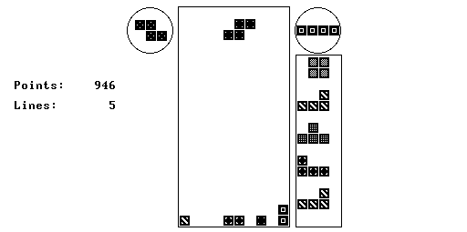

# nand2tetris-tetris

A Tetris game developed for the [NAND To
Tetris](https://www.nand2tetris.org/) course.

This game is developed using the "Jack" language, and designed to run on the
"Hack" hardware platform.

> Screenshot of Tetris running in the Hack VM emulator

## Features

This Tetris implements:

- A "bag" draw system, with the upcoming pieces shown on the right hand side of
  the screen.
- A "hold" slot that you can swap pieces into and save them for later.
- The full system of rotation logic, including kicks.
- Both "soft" and "hard" drop styles.

## Exclusions

This Tetris does not have:

- Increasing speed as the player "levels up". This game is already flying
  pretty close to the Sun, as far as the performance of the VM emulator goes.
  Trying to make it go faster is not likely to be a good experience for the
  player.
- Scoring based on advanced stuff like T-Spins and back-to-back moves. The
  scoring system here is deliberately simple; we award points for line clears
  (with bonuses for clearing multiple lines at once) and for hard and soft
  drops, and that's all.

## Controls

All controls are driven by the keyboard:

- **Left/Right** -- Move
- **SPACE** -- Hard Drop
- **Down** -- Soft Drop
- **Z** -- Rotate counter-clockwise
- **X** -- Rotate clockwise
- **C** -- Swap into the Hold slot

## Scoring

| Action | Points |
| ------ | ------ |
| Soft drop | 1 point per line |
| Hard drop | 2 points per line |
| Single line clear | 100 points |
| Double line clear | 300 points |
| Triple line clear | 500 points |
| Quadruple line clear ("Tetris") | 800 points |
